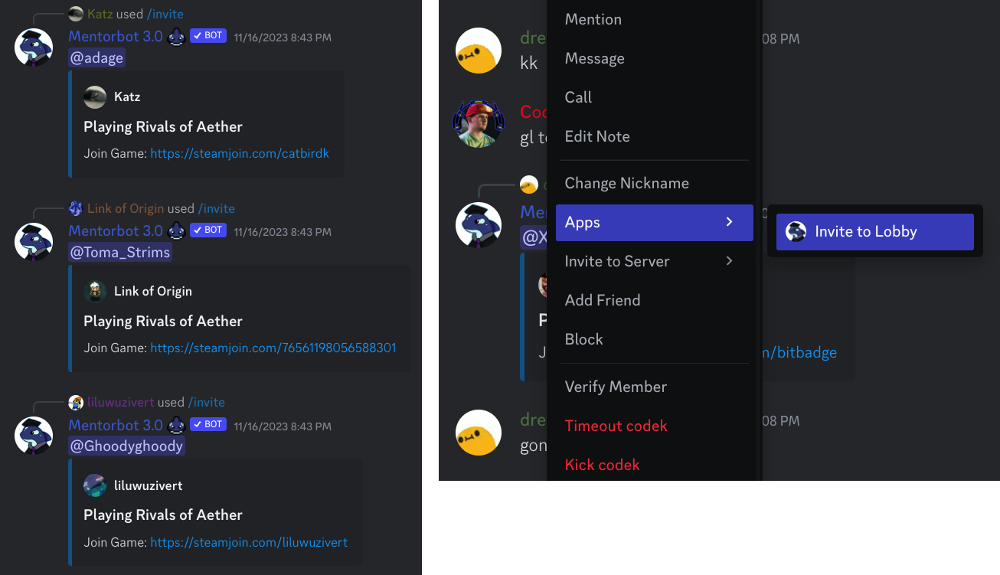

# Mentorbot 3.0

A custom Discord app by written with [discord.py](https://github.com/Rapptz/discord.py), based on [mentorbot](https://github.com/blair-c/Mentorbot3.0).

[Add to your own Discord server]().

## Universal Features

### Hitbox Commands

Provides quick hitbox references for any move in the game, covering the movesets of all 47 characters.

### Informational Commands

SSF2 Frame Data includes a growing list of informational and reference commands, from in-game stats to competitive strategy guides.

### `/invite`
Created to drastically speed up the Steam matchmaking process, allowing users to seamlessly invite other members without leaving Discord. Uses Redis Database to persistently store links between users’ Discord and Steam accounts.

## Terms and Conditions

The bot is free to use for everyone, and always will be. It is made for the purpose of education, and all work is volunteer.
The code will always be available for the public, and as per the license included, may be downloaded, modified, and distributed subject to the conditions outlined in the license.

## Privacy Policy

No personal information is read, gathered, or stored by the bot or the developers.
Use of the bot requires a Discord account, and the [privacy policy for Discord](https://discord.com/privacy) must be observed.
In order for the bot to work properly it must be granted the permissions listed when inviting the bot to a server. Denying these permissions will still invite the bot, but may not allow the bot to work as intended.
